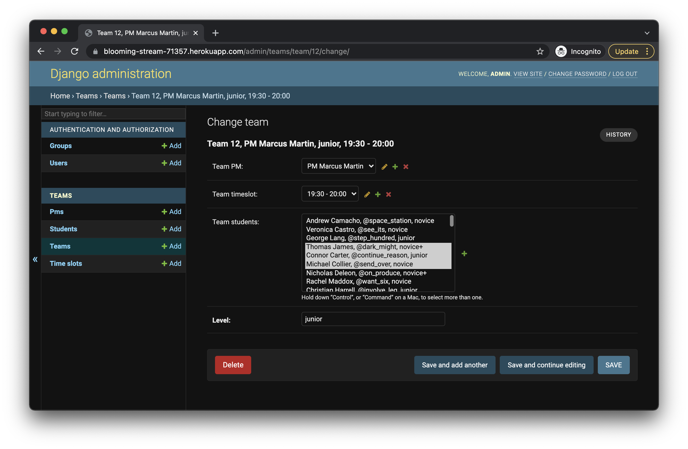

# ProjectsAutomation Service

This project ...

Screenshot placeholder 

## Installation notes
1. Clone project
```bash
git clone https://github.com/gennadis/dvmn_teams.git
cd dvmn_teams
```

2. Create virtual environment
```bash
python3 -m venv venv
source venv/bin/activate
```

3. Install requirements
```bash
pip install -r requirements.txt
```

4. Rename `.env.example` to `.env` and fill your secrets in it

5. Create and load fake data in a database if needed
```bash
python manage.py makefakes
python manage.py loaddata students.json pms.json timeslots.json
```

6. Make empty teams for pms and students
```bash
python manage.py maketeams
```

7. Run server
```bash
python manage.py runserver
```

6. Open
Open app in browser [http://127.0.0.1:8000/teams/](http://127.0.0.1:8000/teams/)
