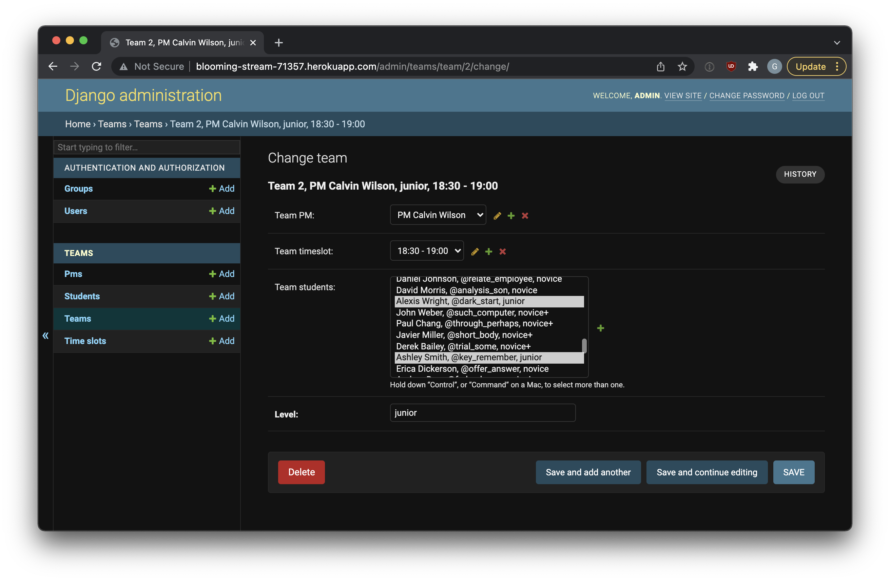

# ProjectsAutomation Service

This project ...


----
1. python manage.py makefakes
2. python manage.py loaddata students.json pms.json timeslots.json
3. python manage.py maketeams
4. open `http://127.0.0.1:8000/teams/`

----


[//]: # (Screenshot placeholder  )


## Installation notes
1. Clone project
```bash
git clone https://github.com/gennadis/dvmn_teams.git
cd dvmn_teams
```

2. Create virtual environment
```bash
python3 -m venv venv
source venv/bin/activate
```

3. Install requirements
```bash
pip install -r requirements.txt
```
4. Rename `.env.example` to `.env` and fill your secrets in it

5. Run
```bash
python manage.py runserver
```

6. Open
Open site in browser [http://127.0.0.1:8000/](http://127.0.0.1:8000/)
